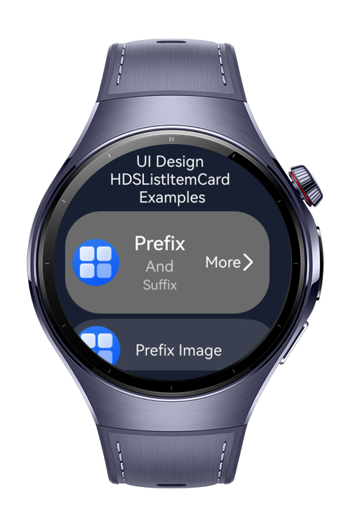
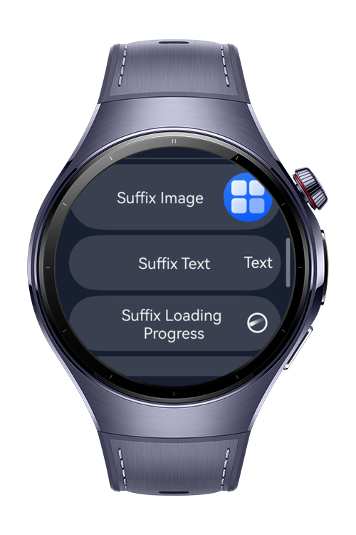
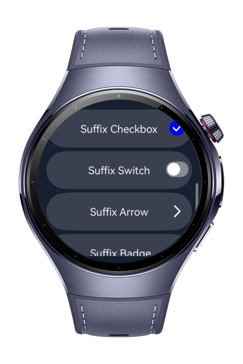
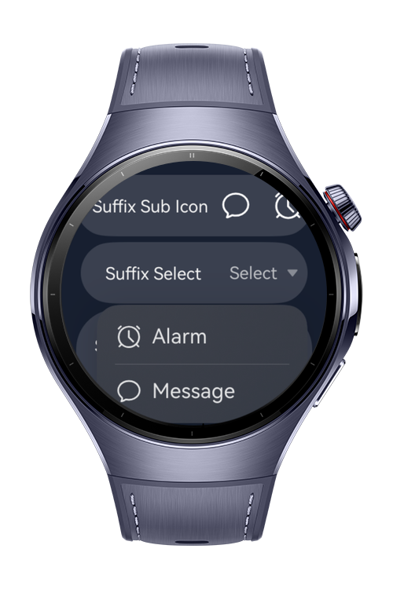

> **Note:** To access all shared projects, get information about environment setup, and view other guides, please visit [Explore-In-HMOS-Wearable Index](https://github.com/Explore-In-HMOS-Wearable/hmos-index).

# How to use HdsListItemCard
With this examples, you can implement all usage examples of hdsListItemCard.

# Preview
<div>
    
    
    
    
</div>

# Use Cases
All usage scenarios related to hdsListItemCard

# Tech Stack

- **Languages**: ArkTS
- **Frameworks**: HarmonyOS SDK 6.0.0(20)
- **Tools**: DevEco Studio Version 6.0.x
- **Libraries**: @kit.ArkUI, @kit.UIDesignKit

# Directory Structure

````
├───AppScope
│   └───resources
│       └───base
│           ├───element
│           └───media
├───entry
│   └───src
│       ├───main
│       │   ├───ets
│       │   │   ├───items 
│       │   │   └───pages 
│       │   │         └───Index
│       │   └───resources
│       │       ├───base
│       │       │   ├───element
│       │       │   ├───media
│       │       │   └───profile
````

# Constraints and Restrictions

## Suported Devices

- Huawei Watch 5

# LICENSE

**HdsListItemCard Examples** is distributed under the terms of the MIT License.
See the [LICENSE](/LICENSE) for more information.